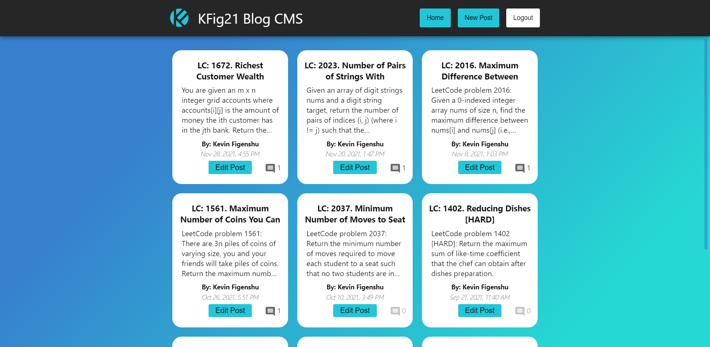
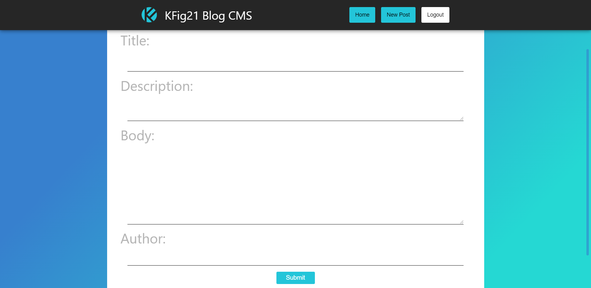
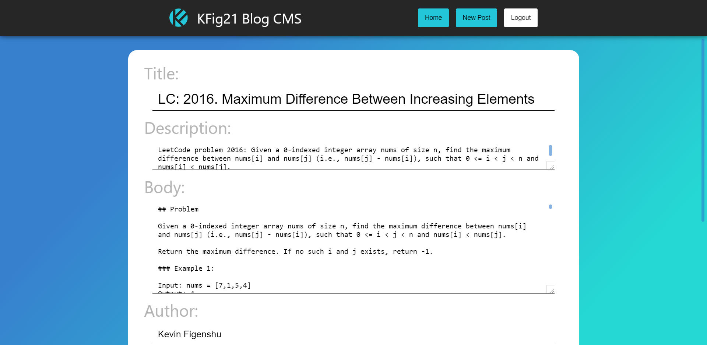
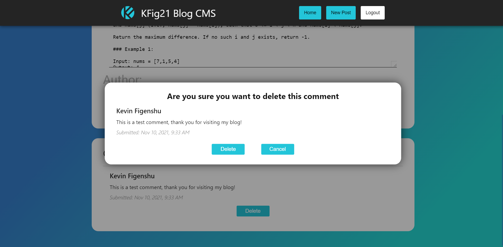

# My Blog (CMS)

<a href="https://kfig21.github.io/blog_cms/" target="_blank" rel="noopener noreferrer">View the project here!</a> 👀 (Admin privileges necessary)

Blog Client repo - <a href="https://github.com/KFig21/blog_client" target="_blank" rel="noopener noreferrer">click here!</a>

Blog API repo - <a href="https://github.com/KFig21/blog_api" target="_blank" rel="noopener noreferrer">click here!</a>

<h3>Summary</h3>

This project was made for The Odin Project NodeJS curriculum. The goal of the project was to build a restful API that can be used to build a blog client and a blog CMS, it was made with the React JS Library, NodeJs, Express, and MongoDb.

 <h3>Notes & Features:</h3>
 <ul>
  <li>Responsive design</li>
  <li>Markdown text in blog posts thanks to <a href="https://www.npmjs.com/package/marked" target="_blank" rel="noopener noreferrer">marked</a> and <a href=https://www.npmjs.com/package/dompurify target="_blank" rel="noopener noreferrer">dompurify</a></li>
  <li>Vistors dont need an account to leave a comment</li>
  <li>Passport Authentication for Admins (CMS only)</li>
  <li>MERN stack CRUD application</li>
 </ul>

<h3>Screenshots</h3>

<h4>Home screen</h4>

<h4>New post screen</h4>

<h4>Edit post screen</h4>

<h4>Delete modal</h4>

---

<h3>Thanks for checking out my project! Any && all feedback is appreciated!</h3>

